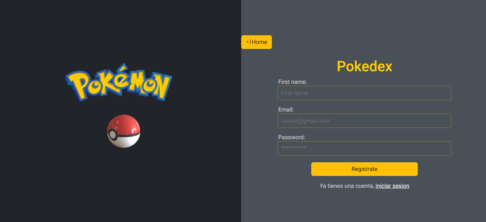

## Pokemon API
* Teniendo una API de Pokemon https://pokeapi.co/api/v2/pokemon/ se necesita consumirla y mostrar
todos los pokemon de la API

* Al hacer click en uno de los pokemon, ingresar a una nueva página con el pokemon seleccionado y
mostrar habilidades e imagen del mismo

* Solo se podrá ingresar a la página del pokemon si el usuario estar logueado. Validar desde la BD el
email y el password del usuario, si el usuario no tiene cuenta también se podrá registrar


# Importante
Para poder tener la experiencia completa que ofrece la solucion planteada es importante seguir los siguientes pasos.

* Clonar o haecr un fork del repositorio.
* Correrlo usando alguntipo de extencion que simule un servidor recomendada *live server* en VSC.
* Hacer la descarga de las dependencias usadas en el poyecto  

``` npm install ```

* Ejecutar el siguiente comando para conectarse al archivo db.json el cual contiene almacenada los datos de los usuarios registrados.  

``` json-server --watch db.json ```

* Si el area de trbajo es un codespace de github usar el siguiente comando para conectarse a la api

``` json-server --watch db.json --host 0.0.0.0```


# To improve
* Insert responsive design in the views sign in, log in ang improve the pokemon card details in tiny screens

# preview
## Sign in



## log in


## Index


## Details
